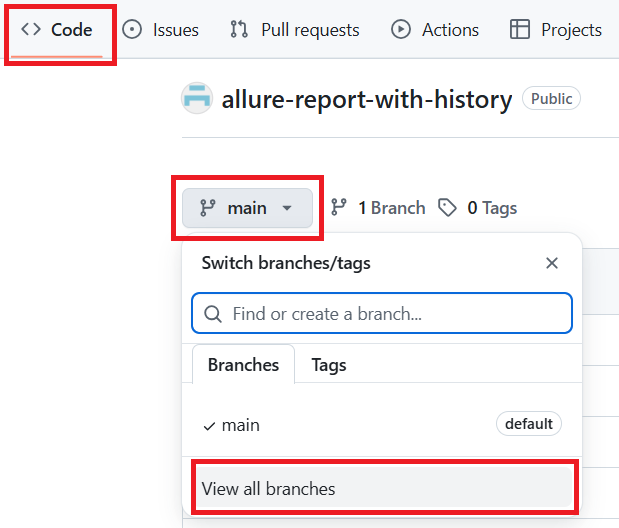
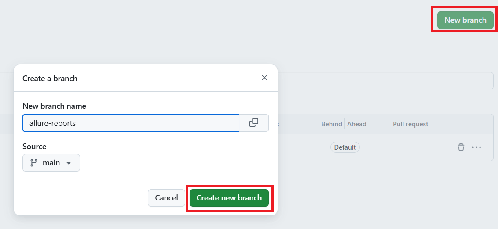
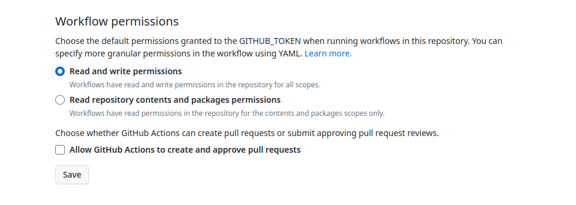
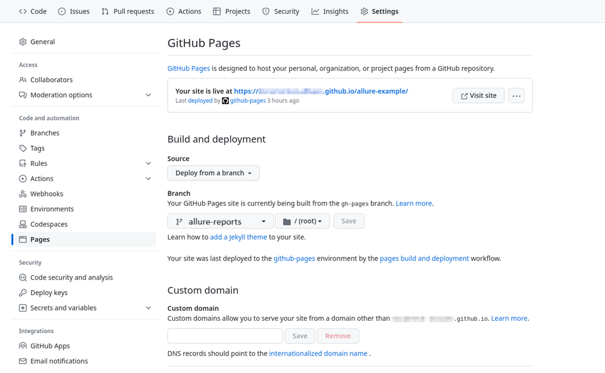
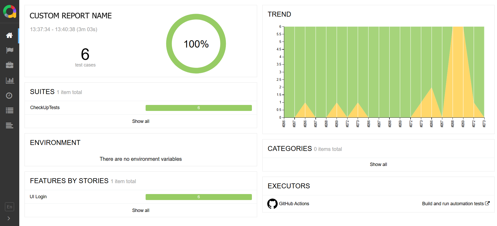
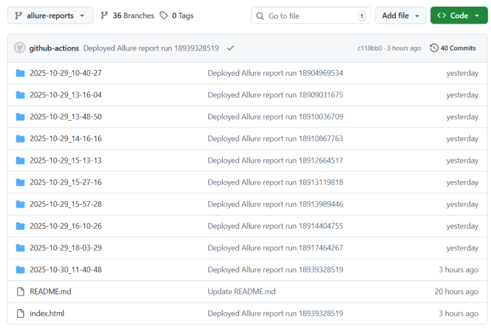
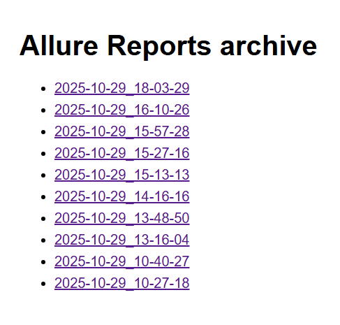

## 📊 Allure Report with history

A GitHub Action to **generate and deploy Allure reports** with optional history and `index.html` for GitHub Pages. It works on any platform (Windows/Linux) where Node.js is available.

This action allows you to keep a history of test reports, automatically generate `executor.json`, and optionally generate `index.html` with links to previous reports.

## Features

- Generate Allure report from downloaded artifact.
- Uses Allure Report version 2.35.1.
- Preserve previous reports (configurable number to keep).
- Automatically generate index.html with links to previous reports.
- Deploy to a specified branch.
- Automatically add a link to the latest report in the GitHub Actions run summary.
- Works on Windows and Linux runners.

## Prerequisites: GitHub Pages Setup

Before using this action, you need to **create a branch and configure GitHub Pages**.  

### 1️⃣ Create a branch for Allure reports

You can **create a branch using Git CLI**:

```bash
git checkout -b allure-reports
git push origin allure-reports
```

Or create a branch directly in the GitHub UI:

1. Go to your repository on GitHub.
2. Click the branch selector dropdown and select **View all branches**.
3. Click **New branch** in the top-right corner..
4. Enter a branch name (e.g., allure-reports) and click **Create new branch**.

<p align="center">  </p>
<p align="center">  </p>

### 2️⃣ Enable write access for workflow runs

When pushing files to the GitHub Pages branch, the workflow uses an authentication token generated by GitHub. However, the default configuration does not allow GitHub Actions to push files to the repository, and to fix this, you need to grant write permissions to the token:

1. On the project's page on GitHub, go to **Settings → Actions → General**.
3. Under the **Workflow permissions** section, select the **Read and write permissions** option.
3. Click **Save**.

<p align="center">  </p>

### 3️⃣ Setup publishing to GitHub Pages

After you've run the workflow for the first time, it will push the test report to a branch but will not actually publish it. For the report to be published, you need to enable an automatic second workflow settings.

1. Make sure that the branch with the content exists (allure-reports in the example above).
2. On the project's page on GitHub, go to **Settings → Pages**.
3. Under the **Build and deployment** section, specify the options:
    - **Source**: “Deploy from a branch”.
    - **Branch**: the branch used for the GitHub Pages content. In the next dropdown list, select “/ (root)”.
4. Click **Save**.
5. Go to the **Actions** tab.
6. Make sure that the workflow run called “pages build and deployment” was automatically created.

Once the run is completed, the test report should appear on the GitHub Pages domain.

<p align="center">  </p>

## Inputs

| Input | Description | Required | Default |
|-------|-------------|----------|---------|
| `allure-results-path` | Path to Allure results directory | Yes | - |
| `deploy-branch` | Branch to publish Allure reports | Yes | - |
| `reports-to-keep` | Number of reports to keep in archive | No | `20` |
| `gen-index` | Whether to generate index.html with links to previous reports | No | `true` |
| `gh-pages-url` | Base URL where reports are hosted | No | - |
| `git-user-name` | Git user name for commits | No | `github-actions` |
| `git-user-email` | Git user email for commits | No | `actions@github.com` |
| `report-name` | Custom name for the report | No | `Allure Report MM/DD/YYYY` |


## Usage

### Example Workflow

```yaml
name: Allure Report Example
on:
  workflow_dispatch:

jobs:
  generate-and-deploy-report:
    runs-on: ubuntu-latest
    steps:
      - name: Checkout repository
        uses: actions/checkout@v3

      - name: Download Allure results artifact
        uses: actions/download-artifact@v4
        with:
          name: allure-results
          path: ./allure-results

      - name: Generate and deploy Allure report
        uses: velychkod/allure-report-with-history@v1.0
        with:
          allure-results-path: './allure-results'
          deploy-branch: 'allure-reports'
          reports-to-keep: 10
          gen-index: true
          gh-pages-url: 'https://username.github.io/repo-name'
          report-name: 'My Test Suite'
        env:
          GITHUB_TOKEN: ${{ secrets.GITHUB_TOKEN }}
```

## 📸 Example Reports

<p align="center">
  
  
  
</p>
